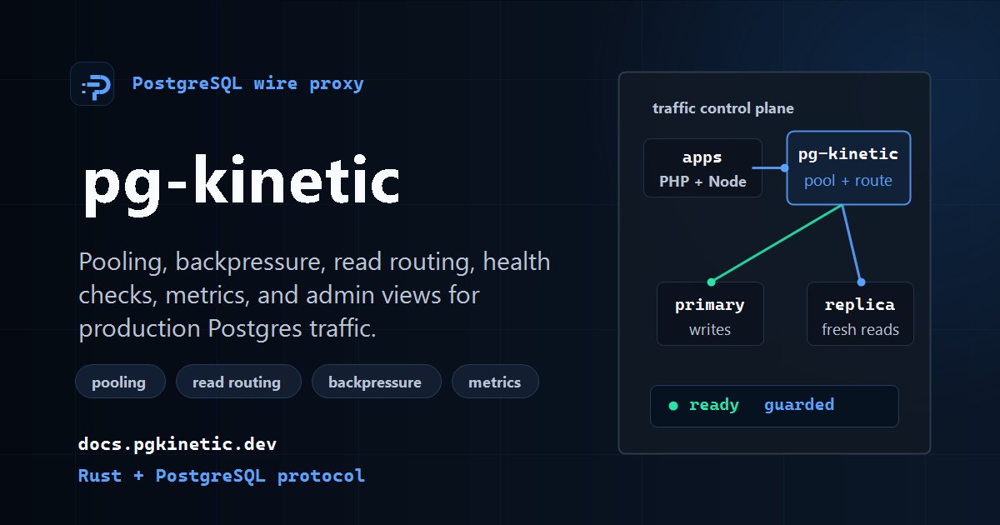

<p align="center">
  
</p>

<p align="center">
  <a href="https://pgkinetic.dev"></a>
  <a href="https://docs.pgkinetic.dev"></a>
  <a href="https://helm.pgkinetic.dev"></a>
  <a href="https://github.com/HookWoods/pg-kinetic/pkgs/container/pg-kinetic"></a>
</p>

<p align="center">
  
  
  
  
</p>

# pg-kinetic

**Keep PostgreSQL responsive under connection spikes.** pg-kinetic is a drop-in Rust PostgreSQL wire proxy: keep your driver and SQL, then add transaction pooling, route-level backpressure, read routing, and operator-visible health.

## 🚀 Install

Use the published container image for a configured host:

```bash
docker pull ghcr.io/hookwoods/pg-kinetic:latest
docker run --rm \
  -v "$PWD/pg-kinetic.toml:/etc/pg-kinetic/pg-kinetic.toml:ro" \
  ghcr.io/hookwoods/pg-kinetic:latest \
  --config-file /etc/pg-kinetic/pg-kinetic.toml
```

Use the Helm repository for Kubernetes:

```bash
helm repo add pgkinetic https://helm.pgkinetic.dev
helm repo update
helm install pg-kinetic pgkinetic/pg-kinetic \
  --set image.repository=ghcr.io/hookwoods/pg-kinetic \
  --set image.tag=latest
```

Use immutable image tags for controlled production rollouts.

## ⚡ Local Smoke Test

Run a complete local stack: PostgreSQL plus pg-kinetic, built from this checkout.

```bash
git clone https://github.com/HookWoods/pg-kinetic.git
cd pg-kinetic
docker compose -f deploy/docker-compose.yml up -d --build
```

This builds the local image, starts PostgreSQL, and exposes pg-kinetic on `localhost:6432`.

Verify that the proxy is live and ready before pointing an application at it:

```bash
curl -fsS http://127.0.0.1:9091/healthz
curl -fsS http://127.0.0.1:9091/readyz

PGPASSWORD=pgkinetic PGSSLMODE=disable \
  psql "postgres://pgkinetic@127.0.0.1:6432/pgkinetic" \
  -c "select 1;"
```

Expected health responses are `live` and `ready`. The query uses the proxy, not the PostgreSQL container directly.

| Local port | Purpose |
| --- | --- |
| `6432` | PostgreSQL listener through pg-kinetic |
| `7000` | Operator admin listener |
| `9090` | Prometheus metrics endpoint |
| `9091` | Liveness and readiness endpoints |
| `55432` | Direct PostgreSQL access for local comparison |

Stop the local stack when you are finished:

```bash
docker compose -f deploy/docker-compose.yml down
```

## ✨ Why pg-kinetic

| Capability | What it gives you |
| --- | --- |
| 🧭 **Connection boundary** | Accept PostgreSQL wire connections before they consume backend capacity. |
| 🔒 **Conservative sessions** | Use transaction pooling with explicit handling for session state and prepared statements. |
| 🚦 **Backpressure** | Bound route queues, checkout waiters, timeouts, and overload behavior. |
| 📊 **Operator visibility** | Inspect health, readiness, metrics, and PostgreSQL-protocol admin views. |
| 🧪 **Reviewable changes** | Use compatibility, regression, and benchmark workflows to check behavior. |

## 🛣️ From Local Stack To Production

| Stage | Use it for | Start here |
| --- | --- | --- |
| 🧰 Local Compose | Development, integration checks, and operator familiarization | [Quickstart](docs/quickstart.md) |
| 📦 Configured container | A controlled environment with your own PostgreSQL backend | [Installation](docs/installation.md) and [Configuration](docs/configuration.md) |
| ☸️ Kubernetes | Helm install, render checks, and cluster rollout | [Kubernetes deployment](docs/kubernetes.md) |
| 🛡️ Production rollout | Readiness, drain, migration, and rollback readiness | [Production runtime](docs/production-runtime.md) and [Migration](docs/migration.md) |

Production Docker installs use `ghcr.io/hookwoods/pg-kinetic:latest` or an immutable release tag. Helm installs use the repository at `https://helm.pgkinetic.dev`.

## 🧑‍💻 Operator Workflow

After the quickstart, these are the usual next steps:

1. Set your PostgreSQL backend and connection limits in `pg-kinetic.toml`.
2. Verify readiness and run a representative query through port `6432`.
3. Inspect pool state through the admin listener and scrape metrics from port `9090`.
4. Exercise timeout, backpressure, and rollback behavior before changing production traffic.

The [configuration guide](docs/configuration.md), [admin reference](docs/admin.md), [metrics catalog](docs/metrics.md), and [health and drain guide](docs/health-and-drain.md) cover those steps in detail.

## 🧩 Capabilities

| Area | What pg-kinetic provides |
| --- | --- |
| Connections | PostgreSQL wire protocol proxying, transaction pooling, and virtual session handling |
| Routing | Read routing and route-aware capacity controls |
| Reliability | Health, readiness, bounded waiting, timeouts, and explicit overload responses |
| Observability | PostgreSQL-protocol admin views, Prometheus metrics, and trace configuration |
| Verification | Compatibility tests, regression workflows, benchmark tooling, and deployment assets |

Sharding, policy, mirroring, compatibility, benchmarking, and packaging also have dedicated documentation. Treat preview tooling separately from the live traffic path when evaluating a deployment.

## 📚 Documentation

**Get running**

- [Installation](docs/installation.md)
- [Quickstart](docs/quickstart.md)
- [Configuration](docs/configuration.md)
- [CLI reference](docs/commands.md)

**Operate safely**

- [Transaction pooling and virtual sessions](docs/transaction-pooling.md)
- [Backpressure](docs/backpressure.md)
- [Prepared statements](docs/prepared-statements.md)
- [TLS and authentication](docs/tls-and-auth.md)
- [Health, readiness, and drain](docs/health-and-drain.md)
- [Troubleshooting](docs/troubleshooting.md)

**Validate changes**

- [Architecture](docs/architecture.md)
- [Compatibility matrix](docs/compatibility.md)
- [Regression workflow](docs/regression.md)
- [Benchmarking](docs/benchmarking.md)
- [Testing](docs/testing.md)

The published documentation is available at [docs.pgkinetic.dev](https://docs.pgkinetic.dev).
