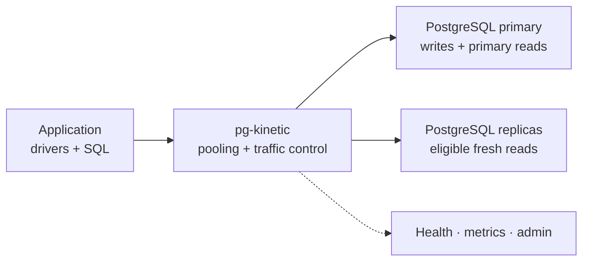

<p align="center">
  
</p>

<p align="center">
  <a href="https://pgkinetic.dev"></a>
  <a href="https://docs.pgkinetic.dev"></a>
  <a href="https://helm.pgkinetic.dev"></a>
  <a href="https://github.com/HookWoods/pg-kinetic/pkgs/container/pg-kinetic"></a>
</p>

<p align="center">
  
  
  
  
</p>

# pg-kinetic

**Keep PostgreSQL responsive when connection demand spikes.** pg-kinetic is a Rust PostgreSQL wire proxy that sits between your application and database. Keep your drivers and SQL; add a controlled connection boundary with transaction pooling, predictable overload handling, and conservative replica reads.



## Start locally

The quickest way to try pg-kinetic is the included Compose stack. It builds the proxy, starts PostgreSQL, and exposes the proxy on `localhost:6432`.

```bash
git clone https://github.com/HookWoods/pg-kinetic.git
cd pg-kinetic
docker compose -f deploy/docker-compose.yml up -d --build
```

Confirm that the proxy is ready, then run a query through it:

```bash
curl -fsS http://127.0.0.1:9091/readyz

PGPASSWORD=pgkinetic PGSSLMODE=disable \
  psql "postgres://pgkinetic@127.0.0.1:6432/pgkinetic" -c "select 1;"
```

Use `docker compose -f deploy/docker-compose.yml down` to stop the stack. The [quickstart](https://docs.pgkinetic.dev/quickstart) includes the local ports, admin connection, and troubleshooting notes.

## Install

The published container is the default installation path:

```bash
docker pull ghcr.io/hookwoods/pg-kinetic:latest
```

Mount your configuration and run the image in the network that can reach PostgreSQL. Pin an immutable release tag for production rollouts.

```bash
docker run --detach --name pg-kinetic --restart unless-stopped \
  --publish 6432:6432 --publish 7000:7000 \
  --publish 9090:9090 --publish 9091:9091 \
  --volume "$PWD/pg-kinetic.toml:/etc/pg-kinetic/pg-kinetic.toml:ro" \
  ghcr.io/hookwoods/pg-kinetic:latest \
  --config-file /etc/pg-kinetic/pg-kinetic.toml
```

For Kubernetes, install from the Helm repository:

```bash
helm repo add pgkinetic https://helm.pgkinetic.dev
helm repo update
helm install pg-kinetic pgkinetic/pg-kinetic
```

See [installation](https://docs.pgkinetic.dev/installation) for a complete deployment reference and [configuration](https://docs.pgkinetic.dev/configuration) for the minimal runtime config.

## What you get

| Capability | Why it matters |
| --- | --- |
| **Transaction pooling** | Reuse backend connections while conservatively pinning sessions that carry state pg-kinetic cannot safely replay. |
| **Traffic control** | Bound backend checkout, route concurrency, queues, timeouts, and buffers so overload fails predictably. |
| **Read routing** | Send eligible, fresh reads to replicas; ambiguous or unsafe work stays on the primary. |
| **Production visibility** | Expose readiness, Prometheus metrics, and PostgreSQL-protocol admin views for pools, clients, servers, and limits. |
| **Secure connectivity** | Support client and backend TLS plus pass-through, trust, and SCRAM-SHA-256 authentication modes. |

Point existing PostgreSQL clients at pg-kinetic instead of the backend:

```text
postgres://app_user@pg-kinetic:6432/app_db
```

## Ready for traffic, explicit about limits

The live runtime supports PostgreSQL wire proxying, transaction pooling, route-aware backpressure, conservative read routing, TLS/authentication, health checks, metrics, and admin views.

Sharding, policy, and mirroring currently provide preview or offline tooling only; they are not live traffic features. See [the runtime status](https://docs.pgkinetic.dev), [sharding](https://docs.pgkinetic.dev/sharding), and [policy](https://docs.pgkinetic.dev/policy) before evaluating those paths.

## Documentation

| Goal | Read next |
| --- | --- |
| Configure or deploy | [Configuration](https://docs.pgkinetic.dev/configuration) · [Installation](https://docs.pgkinetic.dev/installation) · [Kubernetes](https://docs.pgkinetic.dev/kubernetes) |
| Pool and route safely | [Transaction pooling](https://docs.pgkinetic.dev/transaction-pooling) · [Read routing](https://docs.pgkinetic.dev/read-routing) · [Backpressure](https://docs.pgkinetic.dev/backpressure) |
| Operate in production | [Health and drain](https://docs.pgkinetic.dev/health-and-drain) · [Admin](https://docs.pgkinetic.dev/admin) · [Metrics](https://docs.pgkinetic.dev/metrics) |
| Validate a rollout | [Preflight and commands](https://docs.pgkinetic.dev/commands) · [Production runtime](https://docs.pgkinetic.dev/production-runtime) · [Compatibility](https://docs.pgkinetic.dev/compatibility) |

Published documentation: [docs.pgkinetic.dev](https://docs.pgkinetic.dev).

## Contributing and security

Read [CONTRIBUTING.md](CONTRIBUTING.md) before opening a substantial change. Report vulnerabilities privately through [SECURITY.md](SECURITY.md).

## License

pg-kinetic is dual-licensed under [Apache-2.0](LICENSE-APACHE) or [MIT](LICENSE-MIT), at your option.
