# Architecture

For platform engineers who need to understand the hot path before trusting a PostgreSQL proxy.

pg-kinetic is built around PostgreSQL wire correctness, conservative backend reuse, and operator-visible decisions. It does not require application driver changes because clients continue speaking the PostgreSQL protocol.

## Data Path

```mermaid
flowchart LR
  Client["PostgreSQL client"] --> Accept["accept socket"]
  Accept --> Startup["startup, TLS, auth"]
  Startup --> Classify["parse and classify"]
  Classify --> Session["virtual session state"]
  Session --> Route["route and freshness decision"]
  Route --> Gate["route backpressure gate"]
  Gate --> Checkout["backend checkout"]
  Checkout --> Forward["wire forward loop"]
  Forward --> Cleanup["reset, replay, release, or discard"]
  Cleanup --> Pool["pool snapshot"]
  Pool --> Backend["PostgreSQL primary or replica"]
```

The proxy parses enough frontend and backend messages to understand startup parameters, transaction state, prepared-statement state, backend readiness, cancellation keys, and unsafe session features. When the state is uncertain, pg-kinetic prefers pinning, recovery, or backend discard over unsafe reuse.

## Hot Path Steps

| Step | What happens | Why it matters |
| --- | --- | --- |
| Accept | The selected runtime engine accepts a PostgreSQL client socket. | Runtime choice changes scheduling, not the protocol contract. |
| Startup | TLS, startup parameters, client authentication, route lookup, and cancel-key issuance run before query traffic. | Clients keep using the PostgreSQL protocol while the proxy owns the front-door policy. |
| Classify | Frontend messages are parsed into query class, transaction state, prepared-statement intent, and unsafe session markers. | Ambiguous traffic stays conservative instead of being routed or pooled optimistically. |
| Checkout | Route backpressure and pool limits decide whether work gets a backend, waits, times out, or fails. | Capacity failure is explicit and observable per route. |
| Forward | Client and backend frames are copied while backend status, ParameterStatus, errors, and ReadyForQuery are observed. | The proxy can preserve client-visible PostgreSQL behavior and record backend state. |
| Cleanup | Idle reusable backends are reset or replayed, pinned sessions stay attached, and uncertain backends are discarded. | Backend reuse never depends on assuming hidden session state is safe. |

## Runtime Engines

Runtime engines plug in at accept and task scheduling boundaries. `thread_per_core` is the default stable engine, while `tokio_default` and `tokio_current_thread` remain stable selectable engines. `experimental_io_uring` is opt-in and outside the default release path.

The engine does not change the documented safety model. TLS/authentication support, pooling behavior, read routing, admin snapshots, and recovery rules remain governed by the stable runtime contract for the selected engine.

## Crate Layout

| Crate | Responsibility |
| --- | --- |
| `pg-kinetic-wire` | PostgreSQL wire protocol parsing and frame helpers. |
| `pg-kinetic-core` | Shared domain models for sessions, routing, preview policy/sharding models, metrics, benchmark, compatibility, and regression. |
| `pg-kinetic-proxy` | Runtime proxy behavior, config loading, admin rendering, benchmarks, profiling, compatibility, regression, and preflight execution. |
| `pg-kinetic` | CLI entry point and command dispatch. |
| `xtask` | Repository automation for CI-style local orchestration. |

## Control Planes

pg-kinetic separates the traffic path from operational control surfaces:

- the client listener accepts PostgreSQL application traffic
- the admin listener accepts PostgreSQL-compatible `SHOW` queries for snapshots
- the health listener exposes HTTP readiness, liveness, and state endpoints
- metrics and traces are emitted from bounded runtime snapshots

This keeps operational reads out of the application traffic pool and avoids requiring a separate SQL extension in PostgreSQL.

## Safety Model

The reuse decision is based on the current client and backend state:

| Condition | Reuse behavior |
| --- | --- |
| Idle and replayable | Backend can return to the pool after reset/replay handling. |
| Open or failed transaction | Backend remains pinned or is recovered before reuse. |
| Temporary table, advisory lock, COPY, LISTEN/NOTIFY | Backend remains pinned until the session is safe or discarded. |
| Unknown protocol state | Backend is discarded instead of being returned to the pool. |
| Recovery timeout | Backend is discarded. |

The same conservative model is used by live routing and prepared-statement behavior. Sharding, policy, and mirroring have domain models and preview/tooling surfaces, but they are not documented as live traffic features today. Speedups must not weaken PostgreSQL wire correctness.

## Observability Model

Runtime decisions become visible through:

- Prometheus/OpenMetrics style metric names
- admin views such as `SHOW CLIENTS`, `SHOW POOLS`, `SHOW ROUTES`, and `SHOW PREPARED`
- compatibility and regression reports
- benchmark report and score outputs
- preflight reports for deployment readiness

Operational outputs redact secret-bearing fields and should be safe to attach to CI logs.
