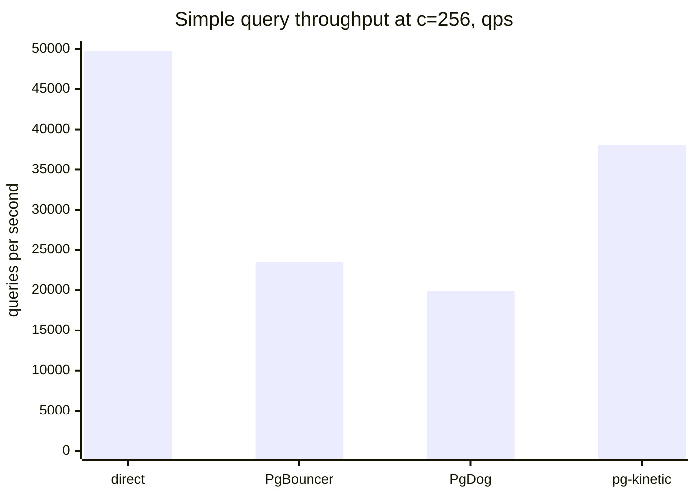
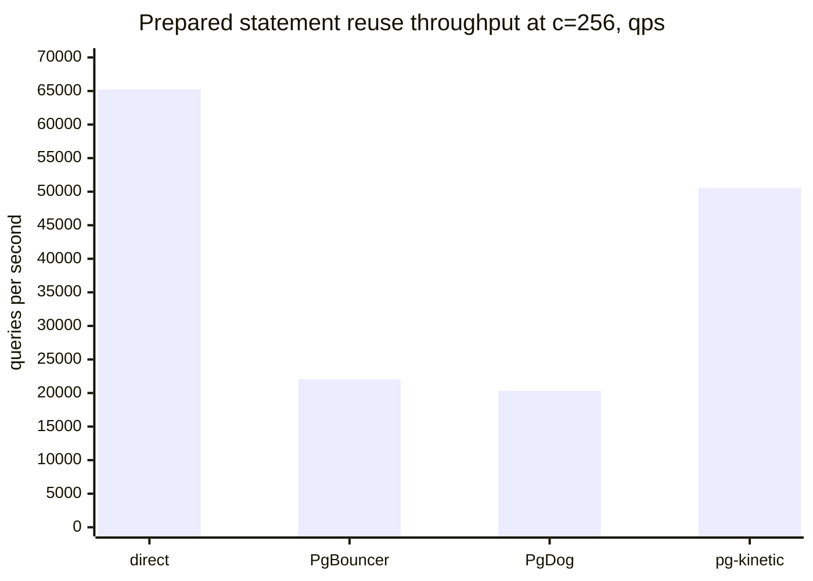

# Benchmark Results

For evaluators who want a quick performance picture before reading the full benchmarking workflow.

These charts use a reviewed live Linux VM run collected on July 23, 2026.
They are not universal performance claims. They are a reproducible snapshot
from one isolated environment: Docker on Linux, 16 CPUs, five 30-second rounds
per target, one PostgreSQL instance per target, and pg-kinetic running with the
`thread_per_core` runtime engine.

The comparison uses capacity-matched benchmark settings: each PostgreSQL
backend accepts up to 512 connections, pg-kinetic uses
`PG_KINETIC_MAX_BACKENDS=512` and `PG_KINETIC_POOL_MAX_SIZE=512`, and PgBouncer
and PgDog use `default_pool_size=512`. Detailed phase timing and debug trace
sampling were disabled for the run.

## Simple Query Throughput

Higher is better.



| Target | c=64 TPS | c=64 avg ms | c=256 TPS | c=256 avg ms |
| --- | ---: | ---: | ---: | ---: |
| direct PostgreSQL | 54,523.9 | 1.174 | 49,748.0 | 5.146 |
| PgBouncer | 23,698.4 | 2.701 | 23,475.2 | 10.905 |
| PgDog | 21,111.7 | 3.031 | 19,886.1 | 12.873 |
| pg-kinetic | 32,808.2 | 1.951 | 38,099.2 | 6.719 |

## Prepared Statement Throughput

Higher is better.



| Target | c=64 TPS | c=64 avg ms | c=256 TPS | c=256 avg ms |
| --- | ---: | ---: | ---: | ---: |
| direct PostgreSQL | 68,834.3 | 0.930 | 65,225.8 | 3.925 |
| PgBouncer | 22,328.8 | 2.866 | 22,058.8 | 11.605 |
| PgDog | 20,957.4 | 3.054 | 20,353.6 | 12.578 |
| pg-kinetic | 40,984.7 | 1.562 | 50,572.9 | 5.062 |

## Tail Latency

Lower is better.

| Workload | Target | c=256 p95 ms | c=256 p99 ms |
| --- | --- | ---: | ---: |
| Simple query | direct PostgreSQL | 10.206 | 13.597 |
| Simple query | PgBouncer | 14.843 | 18.072 |
| Simple query | PgDog | 17.846 | 20.687 |
| Simple query | pg-kinetic | 12.613 | 17.308 |
| Prepared statement reuse | direct PostgreSQL | 7.203 | 9.321 |
| Prepared statement reuse | PgBouncer | 14.565 | 16.728 |
| Prepared statement reuse | PgDog | 17.249 | 19.827 |
| Prepared statement reuse | pg-kinetic | 10.007 | 13.833 |

## How To Read This

Direct PostgreSQL is the ceiling for proxy overhead, not a drop-in comparison for connection-storm behavior. It does not provide the proxy boundary, route-aware backpressure, admin views, or pooling behavior being evaluated.

PgBouncer and PgDog are included as directional comparison targets because the benchmark stack starts one isolated PostgreSQL backend per target. These numbers do not claim broad feature parity or global superiority.

In this snapshot, pg-kinetic is the fastest pooler target for both simple and
prepared read-only workloads. At c=256 it is about 62% faster than PgBouncer on
simple queries and about 129% faster on prepared statement reuse. Direct
PostgreSQL remains the throughput ceiling and is about 31% ahead of pg-kinetic
at c=256.

Transaction-pool write-heavy results are intentionally excluded from the
headline table. The current TPC-B style write workload is dominated by
PostgreSQL commit and fsync behavior, so it is not a clean proxy-overhead
comparison.

## Commands Used

The run used the compose benchmark stack with the comparison profile:

```bash
export PGPASSWORD=postgres
export PG_KINETIC_RUNTIME_ENGINE=thread_per_core
export PG_KINETIC_PHASE_TIMING_SAMPLE_RATE=0.0
export PG_KINETIC_DEBUG_TRACE_SAMPLING_RATE=0.0
export PG_KINETIC_MAX_BACKENDS=512
export PG_KINETIC_POOL_MAX_SIZE=512

sudo -E docker compose -f bench/compose.yml --profile comparison up -d --wait --build
```

Each isolated PostgreSQL backend was initialized before measurement:

```bash
sudo docker compose -f bench/compose.yml exec -T -e PGPASSWORD=postgres driver \
  pgbench -i -s 10 -h pg-direct -p 5432 -U postgres pgkinetic

sudo docker compose -f bench/compose.yml exec -T -e PGPASSWORD=postgres driver \
  pgbench -i -s 10 -h pg-bouncer-db -p 5432 -U postgres pgkinetic

sudo docker compose -f bench/compose.yml exec -T -e PGPASSWORD=postgres driver \
  pgbench -i -s 10 -h pg-dog-db -p 5432 -U postgres pgkinetic

sudo docker compose -f bench/compose.yml exec -T -e PGPASSWORD=postgres driver \
  pgbench -i -s 10 -h pg-kinetic-db -p 5432 -U postgres pgkinetic
```

The simple-query workload was run for each target, each concurrency, and each
of five interleaved rounds:

```bash
pgbench -h 127.0.0.1 -p <port> -U postgres \
  -c <64-or-256> -j 8 -T 30 --log --log-prefix <outside-git-path> \
  -n -S pgkinetic
```

The prepared-statement workload used the same matrix with prepared query mode:

```bash
pgbench -h 127.0.0.1 -p <port> -U postgres \
  -c <64-or-256> -j 8 -T 30 --log --log-prefix <outside-git-path> \
  -n -M prepared -S pgkinetic
```

The target ports were:

| Target | Port |
| --- | ---: |
| direct PostgreSQL | 55432 |
| PgBouncer | 56432 |
| PgDog | 57432 |
| pg-kinetic | 58432 |

The stack was stopped after collection:

```bash
sudo docker compose -f bench/compose.yml --profile comparison down --volumes --remove-orphans
```

## Reproduce Or Update

The checked-in baseline reports used by the regression score gate are:

- `bench/baselines/simple-query.json`
- `bench/baselines/transaction-pool.json`
- `bench/baselines/prepared.json`

The July 23, 2026 capacity-matched VM run was collected as raw benchmark output
outside Git. Read [Benchmarking](./benchmarking.md) before updating these
numbers. Do not replace checked-in baselines with dry-run output or a single
local measurement.
