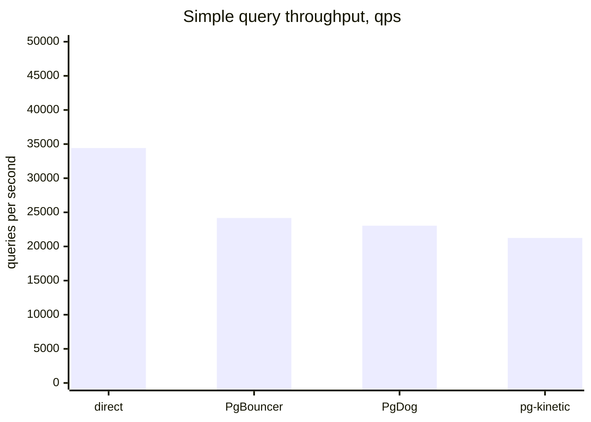
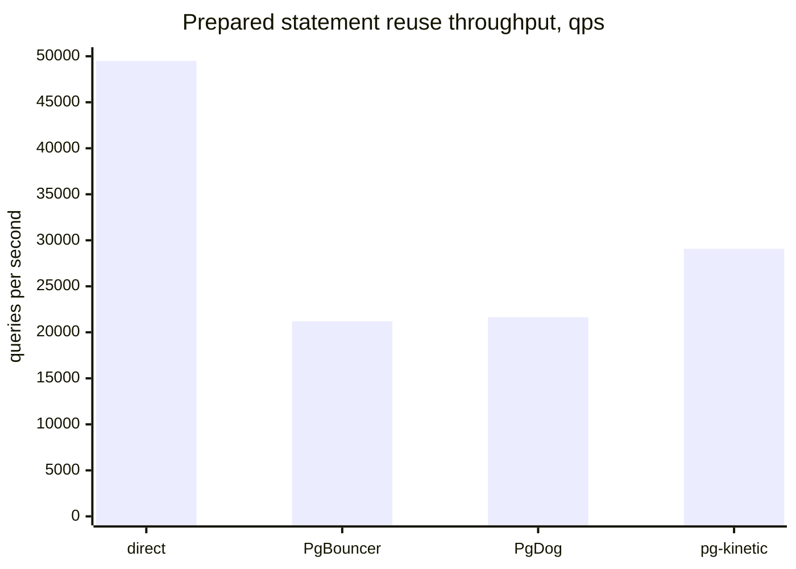
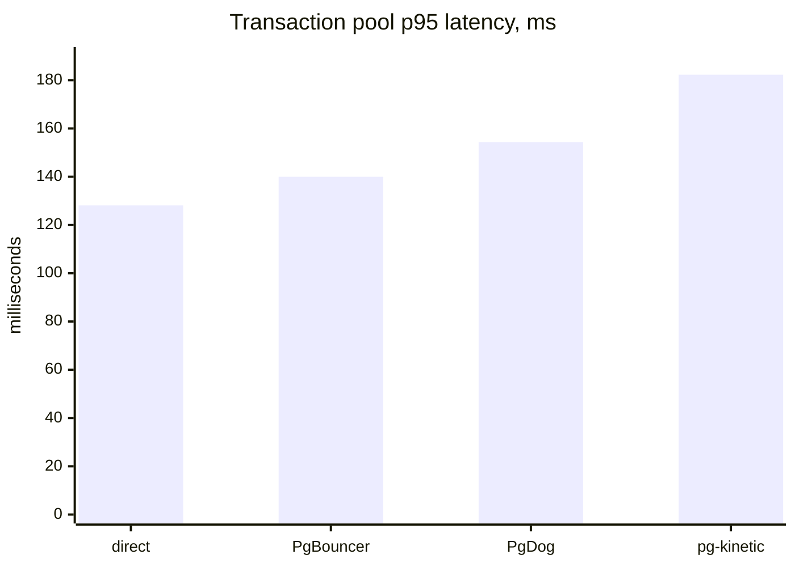

# Benchmark Results

For evaluators who want a quick performance picture before reading the full benchmarking workflow.

These charts use checked-in baseline reports from live Linux runs under `bench/baselines/`. They are not universal performance claims. They are a reproducible snapshot from one isolated environment: Docker on Linux kernel `6.8.0-106-generic`, 16 CPUs, three 30-second rounds, and pg-kinetic running with the `thread_per_core` runtime engine.

## Simple Query Throughput

Higher is better.

## Prepared Statement Throughput

Higher is better.

| Scenario | direct PostgreSQL | PgBouncer | PgDog | pg-kinetic |
| --- | ---: | ---: | ---: | ---: |
| Simple query | 34,427 qps | 24,173 qps | 23,044 qps | 21,253 qps |
| Transaction pool | 726 qps | 516 qps | 464 qps | 502 qps |
| Prepared statement reuse | 49,489 qps | 21,199 qps | 21,649 qps | 29,074 qps |

## Transaction Pool p95 Latency

Lower is better.

| Scenario | direct PostgreSQL | PgBouncer | PgDog | pg-kinetic |
| --- | ---: | ---: | ---: | ---: |
| Simple query | 0.717 ms | 0.894 ms | 0.939 ms | 1.171 ms |
| Transaction pool | 128.109 ms | 139.990 ms | 154.258 ms | 182.290 ms |
| Prepared statement reuse | 0.807 ms | 1.661 ms | 1.551 ms | 1.342 ms |

## How To Read This

Direct PostgreSQL is the ceiling for proxy overhead, not a drop-in comparison for connection-storm behavior. It does not provide the proxy boundary, route-aware backpressure, admin views, or pooling behavior being evaluated.

PgBouncer and PgDog are included as directional comparison targets because the benchmark stack starts one isolated PostgreSQL backend per target. These numbers do not claim broad feature parity or global superiority.

pg-kinetic's strongest story in this snapshot is not the lowest simple-query latency. It is the combination of predictable overload handling, prepared-statement-aware transaction pooling, conservative read routing, metrics, and admin visibility under one documented runtime contract.

## Reproduce Or Update

The source reports are:

- `bench/baselines/simple-query.json`
- `bench/baselines/transaction-pool.json`
- `bench/baselines/prepared.json`

Read [Benchmarking](./benchmarking.md) before updating these numbers. Do not replace checked-in baselines with dry-run output or a single local measurement.
